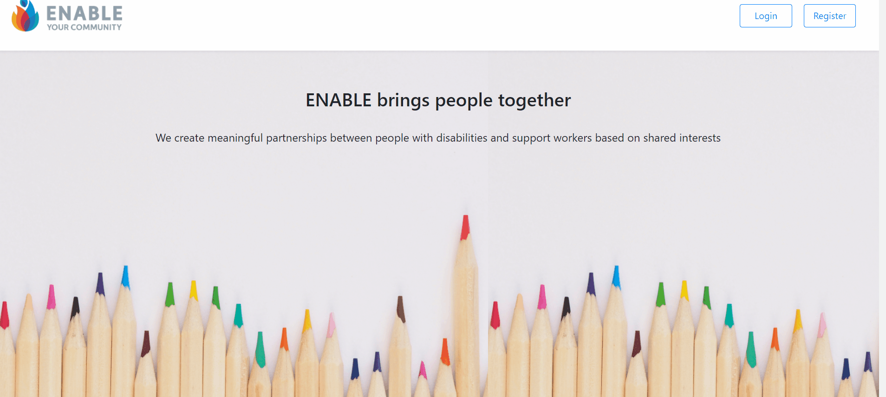
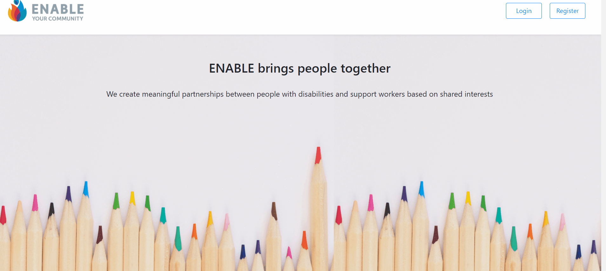

**[You can check out the project here]()**

# Final Project Boilerplate

The project has 2 main folders:

- client (React Front-End)
- backend (Express Back-End)

Run npm install in both folders to install the dependencies.

To start both servers:

`npm start` in the client folder
`npm run dev` in the backend folder

## Final Product





## Project Stack

- React, React Router, Reactstrap
- Node.js, PostgreSQL
- CSS (grid, animation, variables, etc.)

## Project Features

- Enable has 3 different dashboards, Family, worker, and Admin.
- Based on the type of user, user will be shown a specific dashboard.
- Family users have the ability to create an assiatnce request (Providing assistance description, hourly rate, type of pay, and the ability to choose the support worker of their choice).
- On the other hand on the support worker dashboard, workers can receive the request and have the ability to either accept or reject the request. The family will be notified either way.
- After a session has been done, worker is able to upload any bill images for reimbursement, also worker is able to clock in and clock out the session afterwards.
- Family is able to write a review and provide ratings after each session
- On admin dashboard, admin is able to select a time frame and choose a family name, to access the automatically generated invoice, which includes the bill image as well.
- The invoice is downloadable so, admin can easily download the PDF and sends it to the family to make the payment.

## Available Scripts

This project was bootstrapped with [Create React App](https://github.com/facebook/create-react-app).

## Back-End Setup

- create a postgres database. At the terminal, type the following:

  `createdb database_name -O username`

  replace database_name with your database name and username with your own user.

- create a `.env` file with your database settings. Look at .env.example for usage.

- Modify the sql scripts under `db/schema/` to create the tables and seed the data.

- run `npm run reset` that will run the reset scripts in package.json to reset the database. Modify the reset script in package.json accordingly:

```json
"scripts": {
    "start": "node ./bin/www",
    "dev": "nodemon ./bin/www",
    "reset": "psql -U labber -d final_project < ./db/schema/create.sql && psql -U labber -d final_project < ./db/schema/seed.sql"
  },
```

- replace `labber` with your own username and `final_project` with your database name

- currently, the users route is setup with a get and a post as examples. Modify it according to your needs and/or create additional route files.

## Client Setup

- A custom hook in `hooks/useApplicationData.js` contains the state.
- a `useEffect` with an axios request is adding the users in the state. Modify the initial state and the useEffect according to your needs.
